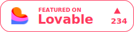
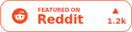
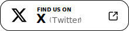
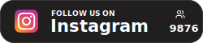
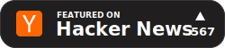
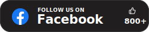
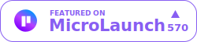
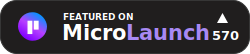

# Launched Badges

> **Universal badges for your product launches.**
> Product Hunt isn’t the only place. Celebrate launches anywhere — Lovable, Reddit, X, Hacker News, and beyond — with drop-in React components.

**Launched Badges** is a set of reusable, plug-and-play React components that showcase your product launches across platforms. Whether it’s Lovable, Reddit, X, or Hacker News, highlight your milestones where your users are — not just on Product Hunt.

## 🚀 Features

- 🏷️ Prebuilt badges for Lovable, Reddit, Hacker News, X, Facebook, Instagram, MicroLaunch
- 🎨 Light/dark themes with flexible sizing and layout control
- ⚙️ Fine-grained over display — customize logo, text, icons, and count (upvotes, likes, followers, link-only, or none)
- 🖼️ Scalable SVG components built for React — plug-and-play and pixel-perfect
- 🧩 Powerful base component for full customizability

## ✨ Try it now

Visit our interactive demo on [Homepage](https://launched-badges.lovable.app/) to customize and preview badges for your projects.

## 📋 Supported Platforms

- **Lovable**
- **Reddit**
- **Hacker News**
- **X (Twitter)**
- **Facebook**
- **Instagram**
- **MicroLaunch**
- **Custom** - Create your own badges with the generic base component

## 🔧 Prerequisites

Launched Badges are built with React.
Please ensure React is installed and properly configured in your project.

```json
{
  "react": "^18.0.0 || ^19.0.0",
  "react-dom": "^18.0.0 || ^19.0.0"
}
```

## 📦 Installation

```bash
npm install @sundaywong/launched-badges
# or
yarn add @sundaywong/launched-badges
# or
pnpm add @sundaywong/launched-badges
```

## 🧩 Usage

### LovableBadge as example

```jsx
import { LovableBadge } from '@sundaywong/launched-badges';

// Basic usage with numeric count
<LovableBadge count={359} linkUrl="https://example.com/my-project" />

// With formatted count string
<LovableBadge count="10.5k" linkUrl="https://example.com/my-project" />

// With dark theme
<LovableBadge count={359} theme="dark" linkUrl="https://example.com/my-project" />

// With custom featured text
<LovableBadge count={359} featuredText="SEEN ON" linkUrl="https://example.com/my-project" />

// With link disabled (links are enabled by default)
<LovableBadge count={359} linkEnabled={false} />

// Hide the count and show a link icon instead
<LovableBadge linkUrl="https://example.com/my-project" displayMode="link" />

// Custom dimensions
<LovableBadge count={359} width={300} linkUrl="https://example.com/my-project" />
<LovableBadge count={359} height={80} linkUrl="https://example.com/my-project" />
```

### Use Other Badges similarly

```jsx
// Use other platform badges the same way
import { 
  RedditBadge, 
  HackerNewsBadge, 
  FacebookBadge,
  InstagramBadge,
  TwitterBadge,
  MicroLaunchBadge
} from '@sundaywong/launched-badges';

// Example with Reddit badge
<RedditBadge count={42} theme="dark" linkUrl="https://reddit.com/r/..." />

// Example with MicroLaunch badge
<MicroLaunchBadge count={570} theme="light" linkUrl="https://microlaunch.net/p/..." />
```

## ✨ Showcase

Here are some examples of the badges in action:

<p align="center">
  &nbsp;&nbsp;&nbsp;
  &nbsp;&nbsp;&nbsp;
  
</p>
<p align="center">
  &nbsp;&nbsp;&nbsp; 
  &nbsp;&nbsp;&nbsp;
  
</p>
<p align="center">
  &nbsp;&nbsp;&nbsp; 
  &nbsp;&nbsp;&nbsp;
</p>


To see more examples and how to use each specific badge, please refer to the [component documentation](./packages/badges/README.md).

## ⚙️ API

### LovableBadge

| Prop | Type | Default | Description |
|------|------|---------|-------------|
| `count` | `number \| string` | - | The count to display. Can be a number or a formatted string (e.g., "10.5k"). |
| `theme` | `'light' \| 'dark'` | `'light'` | The theme of the badge. |
| `linkUrl` | `string` | - | The URL to link to when the badge is clicked. |
| `width` | `number` | `220` | The width of the badge in pixels. If only width is specified, height scales proportionally. |
| `height` | `number` | - | The height of the badge in pixels. If only height is specified, width scales proportionally. |
| `featuredText` | `string` | `'FEATURED ON'` | Custom text for the "featured on" line (max 15 characters). |
| `linkEnabled` | `boolean` | `true` | Whether to make the badge a clickable link. |
| `displayMode` | `'count' \| 'link' \| 'none'` | `'count'` | What to display on the right side of the badge. |
| `iconType` | `'upvote' \| 'likes' \| 'followers' \| 'upvote-arrow'` | `'upvote'` | The type of icon to use next to the count. |
| `className` | `string` | - | Additional CSS classes to apply to the component. |

### Other Badge Components

All other badge components (RedditBadge, HackerNewsBadge, TwitterBadge, etc.) share the same props as LovableBadge. Additionally, the `SocialBadge` component accepts a `platformName` prop to specify a custom platform name.

## 🧪 Development

### Project Structure

```
launched-badges/
├─ packages/
│  └─ badges/  # The main package
├─ examples/
│  └─ demo/    # Demo application
```

### Set up the project

```bash
# Install dependencies
pnpm install

# Start the demo app
pnpm dev

# Run tests
pnpm test

# Build the package
pnpm build
```

## 📝 License

MIT 